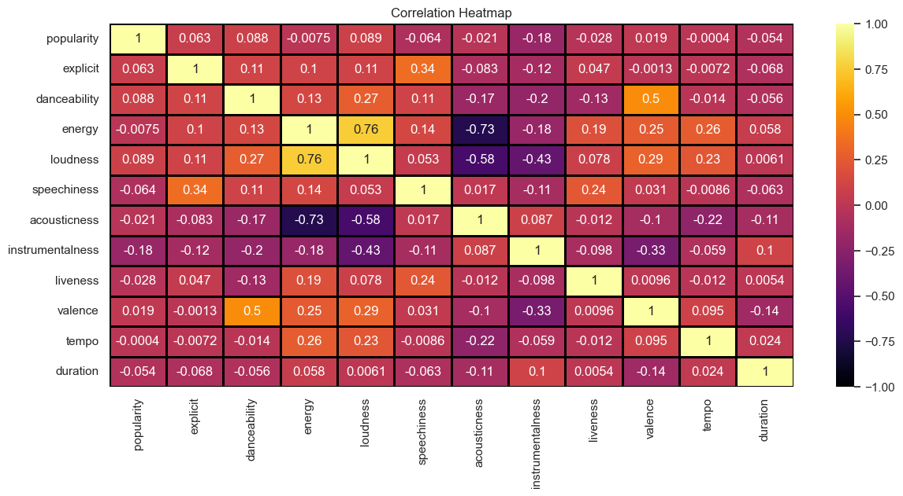
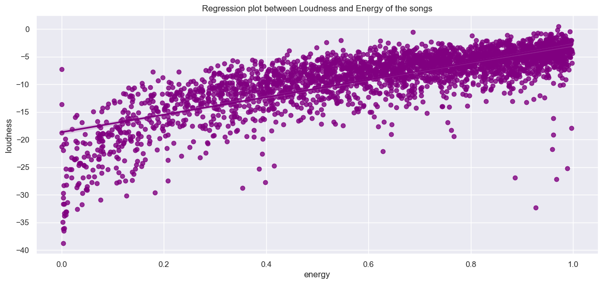
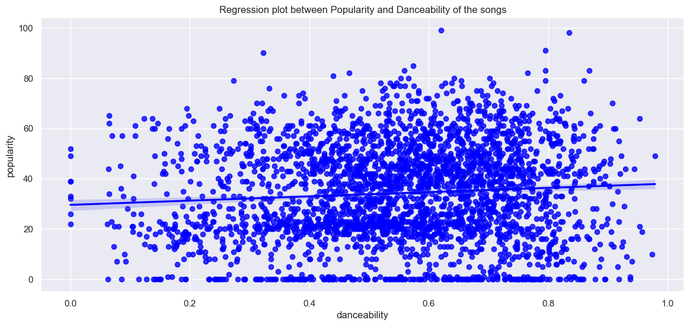
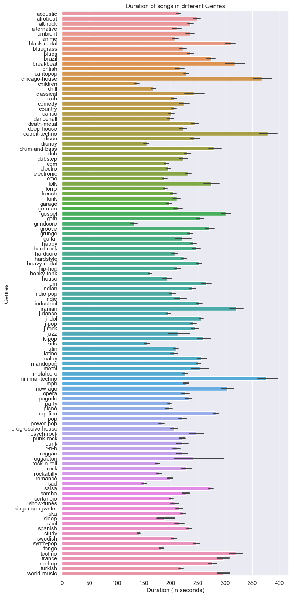
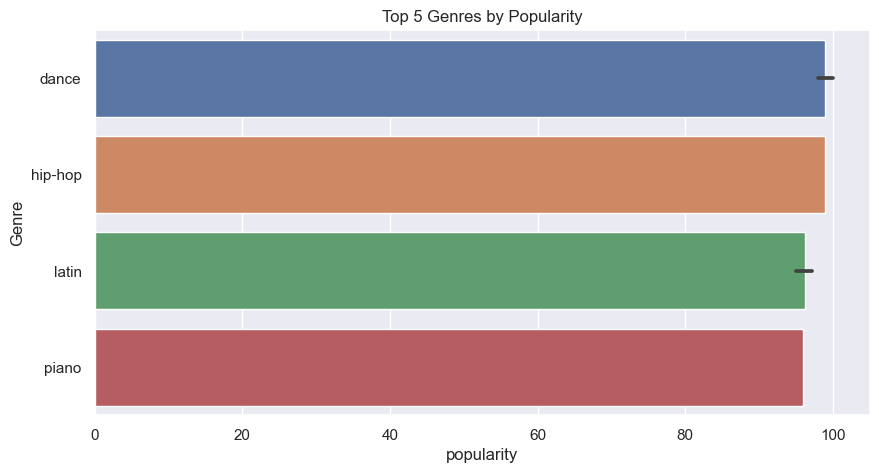

# Spotify Data Analysis
Spotify is a Swedish audio streaming and media services provider founded on 23 April 2006 by [Daniel Ek](https://en.wikipedia.org/wiki/Daniel_Ek) and [Martin Lorentzon](https://en.wikipedia.org/wiki/Martin_Lorentzon). It is one of the largest music streaming service providers, with over 551 million monthly active users, including 220 million paying subscribers, as of June 2023. 

## About This Project
Analyzing the spotify track dataset to find co-relation between features and to find the top 5 popular songs and genre

## Motivation
I have always been curious about how spotify creates the most popular songs playlist

## Installation
- Fork the repository
- Install and run `requirements.txt`
```Python
pip install -r requirements.txt
```

## Insights
- HeatMap for the correlation between the features


- Regression Plot between Energy and Loudness of the songs


- Regression Plot between Popularity and Acousticness of the songs


- Relation between Duration and genre of songs


- Top 5 genres by popularity



## Credit
- https://www.kaggle.com/code/mrankitgupta/spotify-data-analysis-using-python#notebook-container
- https://www.kaggle.com/datasets/maharshipandya/-spotify-tracks-dataset
